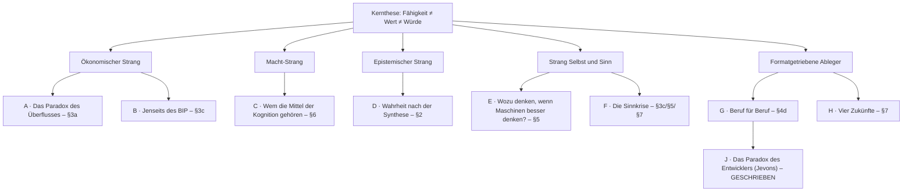
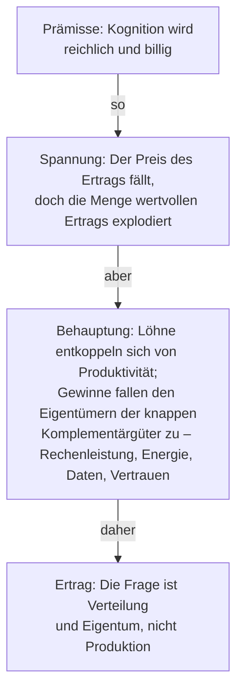
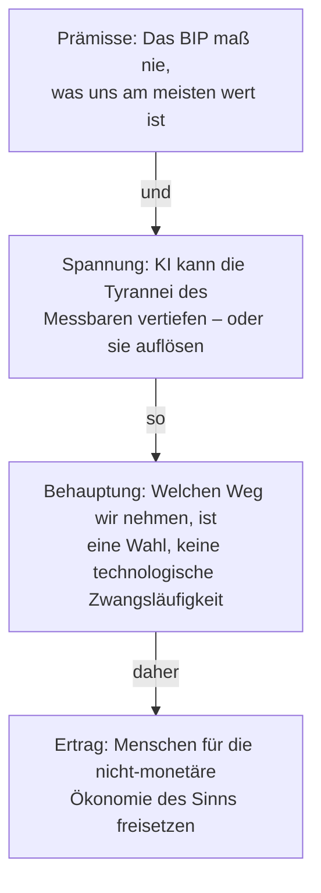
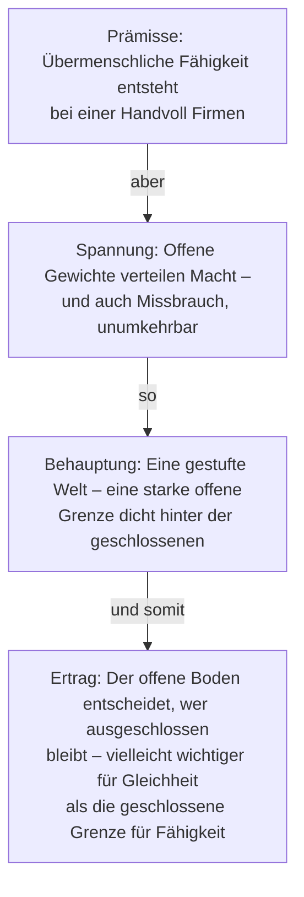
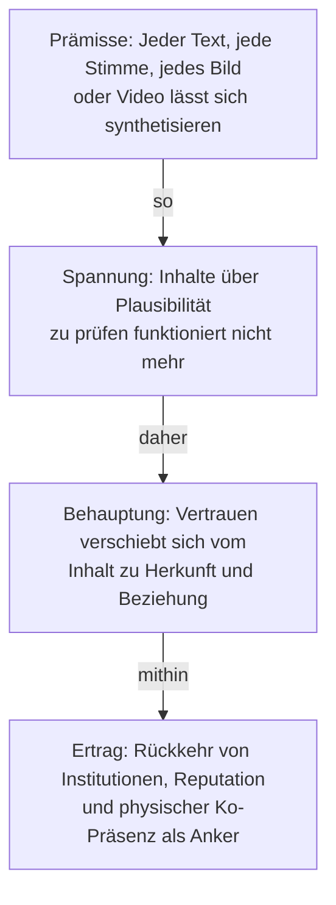
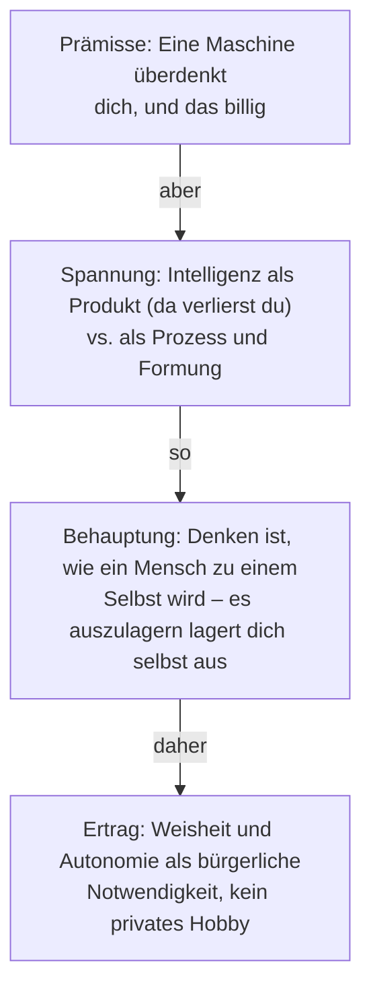
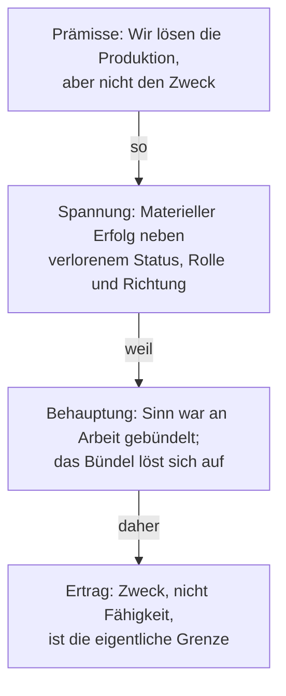
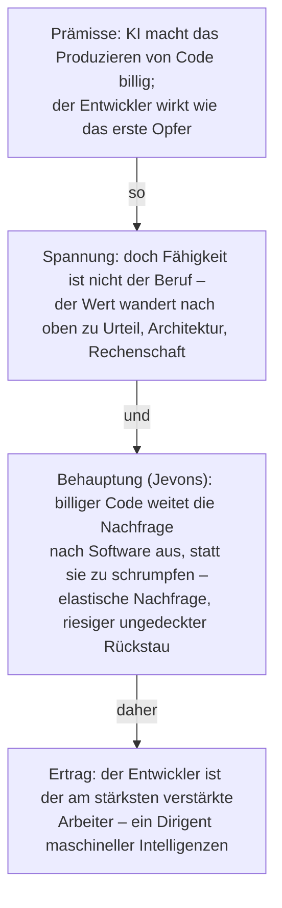

# Leben mit einer KI, die intelligenter ist als wir

*Arbeitsgerüst für einen Essay – Argumente, Unterscheidungen, Szenarien und Struktur.*

---

## 0. Das Rahmungsproblem (zuerst lesen)

Die Formulierung „KI, die intelligenter ist als Menschen" verbirgt drei verschiedene
Behauptungen, die ineinander vermengt werden. Sie auseinanderzuhalten ist der mit Abstand
wichtigste Schritt, den der Essay vollziehen kann, denn fast jedes verworrene öffentliche
Argument entsteht dadurch, dass man unbemerkt von der einen zur anderen gleitet:

1. **Enge Überlegenheit** – KI schlägt Menschen bereits bei bestimmten Aufgaben (Schach,
   Proteinfaltung, viele Probleme der Prognose und Mustererkennung, flüssiger Text in 100
   Sprachen). Dies ist *heute unstrittig wahr* und greift seit Jahrzehnten immer weiter
   um sich.
2. **Allgemeine Überlegenheit** – KI erreicht oder übertrifft den durchschnittlichen
   Menschen bei den meisten *wirtschaftlich und intellektuell* relevanten kognitiven
   Aufgaben. Dies ist das umstrittene Regime, das „mehr oder weniger gerade jetzt"
   eintritt.
3. **Superintelligenz** – KI übertrifft die *besten* Menschen und das *Kollektiv* der
   Menschen in praktisch allem, einschließlich der eigenen Verbesserung. Dies ist der
   spekulative Ausläufer.

> **Thesen-Kandidat:** Die interessante und dringliche Frage ist nicht der
> Science-Fiction-Ausläufer (Superintelligenz), sondern das *mittlere Regime, in das wir
> bereits eintreten* – in dem Maschinen bei den meisten kognitiven Tätigkeiten
> leistungsfähiger sind als die meisten Menschen, dabei aber nicht weise, nicht
> rechenschaftspflichtig und keine Träger von Sinn sind. Die Aufgabe der Gesellschaft
> besteht darin, drei Dinge zu entkoppeln, die wir nachlässig zusammenwerfen:
> **Fähigkeit, Wert und Würde.**

Diese Entkopplung ist das Rückgrat des gesamten Essays. Fähigkeit (was getan werden kann)
wandert zu den Maschinen ab. Wert (was wir wirtschaftlich belohnen) wird neu bewertet. Würde
(was ein menschliches Leben bedeutsam macht) war nie dasselbe wie eines von beiden, und das
KI-Zeitalter zwingt uns endlich, das auch laut auszusprechen.

[*Im Englischen stehen hier die drei Begriffe „capability", „value" und „worth"; da „value"
und „worth" im Deutschen beide „Wert" heißen, steht „Wert" für den ökonomischen „value" und
„Würde" für „worth". „Würde" meint hier nicht die bloße Höflichkeits- oder Amtswürde, sondern
den inneren, unbedingten Wert, der ein Leben bedeutsam macht – den Rang, den ein Mensch allein
als Mensch besitzt und der, anders als ein Preis, nicht aufgewogen werden kann (Anklang an
Kants Unterscheidung von Würde und Preis).*]

---

## 1. Von welcher Art von Intelligenz reden wir überhaupt?

Ein zentrales Argument, das die Leserschaft früh braucht: „Intelligenz" ist nicht eine
einzige Sache, und KI ist auf manchen Achsen übermenschlich, während sie auf anderen
untermenschlich ist. Baue eine kleine Taxonomie auf und nutze sie durchgängig.

| Achse | Grob, worum es geht | Wo KI steht (2026) | Menschlicher Vorsprung? |
|---|---|---|---|
| **Kristallin / Wissen** | Abruf, Synthese bekannter Fakten | Übermenschliche Breite | Nein |
| **Fluide / Schlussfolgern** | Neuartiges Problemlösen im Kontext | Rasch steigend, ungleichmäßig | Schrumpfend |
| **Verkörpert / sensomotorisch** | Handeln in der unordentlichen physischen Welt | Schwach, teuer | Ja, vorerst |
| **Sozial / relational** | Vertrauen, Fürsorge, eine Situation lesen, *bei* jemandem sein | Nachgeahmt, nicht getragen | Ja |
| **Moralisch / wertend** | Entscheiden, was bedeutsam sein *soll* | Nicht ihre Funktion | Ja (per Definition) |
| **Weisheit / Urteilskraft unter Einsatz** | Wissen, was zu tun sich lohnt, Konsequenzen annehmen | Fehlt | Ja |

**Zu entwickelndes Argument:** Ein System „intelligenter als Menschen" zu nennen ist ein
Kategorienfehler, wenn Intelligenz *all das oben Genannte* bedeutet. Maschinen
kolonisieren die ersten beiden Zeilen. Die unteren drei sind nicht bloß „noch nicht
gelöst" – einige von ihnen sind wohl *nicht die Art von Sache, die ein Werkzeug haben
kann*, weil sie ein Subjekt voraussetzen, das zur Verantwortung gezogen werden kann, das
etwas zu verlieren hat, das die Konsequenzen erleiden kann. Das ist das begriffliche
Scharnier für „worauf sollten sich Menschen konzentrieren".

---

## 2. Wie sich die Prinzipien des Zusammenlebens verändern

Rahme dies so: Welche gesellschaftlichen Institutionen setzten stillschweigend voraus,
dass *menschliche Kognition knapp und wertvoll* war, und müssen nun neu begründet werden?

- **Autorität und Expertise.** Jahrhundertelang floss Status aus dem Wissen von Dingen.
  Wenn Wissen billig und allgegenwärtig ist, muss Autorität zu *Urteilsvermögen,
  Verantwortung und Vertrauen* abwandern – zu der Frage, wer entscheidet und wer
  rechenschaftspflichtig ist, nicht wer weiß. Risiko: ein hohler Populismus des „jetzt
  ist jeder Experte" oder dessen Gegenteil, eine Priesterschaft der Wenigen, denen die
  Modelle gehören.
- **Vertrauen und Wahrheit.** Wenn jeder Text, jede Stimme, jedes Bild oder Video
  synthetisiert werden kann, verschieben sich Gesellschaften vom *Überprüfen von Inhalten*
  zum *Überprüfen von Herkunft und Beziehung*. Wahrheit dreht sich weniger um „ist das
  plausibel?" und mehr um „wessen Wort steht dahinter, und was verlieren sie, wenn es
  falsch ist?" Erwarte eine Rückkehr von Institutionen, Reputation und physischer
  Ko-Präsenz als Vertrauensanker.
- **Bildung.** Wenn der Sinn der Bildung darin bestand, Wissen in Köpfe zu laden, ist sie
  überholt. Wenn der Sinn darin bestand, Urteilsvermögen, Geschmack, Charakter und die
  Fähigkeit zu formen, gute Fragen zu stellen, wird sie *wichtiger*, nicht unwichtiger.
  Der Essay kann argumentieren, dass Bildung sich von *Antworten* hin zu *Fragen,
  Urteilskraft und Integrität* wenden muss.
- **Handlungsfähigkeit und Abhängigkeit.** Eine Gesellschaft, die Kognition auslagert,
  riskiert erlernte Hilflosigkeit (vgl. wie GPS die Orientierungsfähigkeit erodierte).
  Gegenargument: Jedes Werkzeug tut dies (die Schrift erodierte das Gedächtnis – Platons
  *Phaidros*), und wir haben uns angepasst. Die ehrliche Frage ist, *welche* Fähigkeiten
  wir in Menschen bewusst bewahren müssen, selbst wenn eine Maschine sie übernehmen
  könnte – etwa die Fähigkeit zu rechnen zu erhalten oder zu regieren.
- **Macht und Konzentration.** Die tiefste politische Frage: Übermenschliche Fähigkeit
  wird derzeit von einer Handvoll Organisationen mit seltener Rechenleistung und Daten
  hervorgebracht. „Gut" zusammenzuleben hängt vielleicht weniger von der Intelligenz der
  Modelle ab als davon, *wer sie kontrolliert.* (Hier kommen offene Gewichte ins Spiel –
  siehe §6.)

---

## 3. Wie sich die Wirtschaft verändert – Wert jenseits des Geldes

Dein Instinkt, dass „Wert nicht in allen Fällen in Geld gemessen werden muss", ist stark.
Schärfe ihn zu unterschiedlichen Mechanismen:

### 3a. Die Neubewertung kognitiver Arbeit
- Klassische Ökonomie: Knappe, produktive Dinge erzielen einen Preis. Wenn allgemeine
  Kognition reichlich und billig wird, fällt der *Preis* kognitiven Ertrags in Richtung
  der Kosten von Rechenleistung – selbst wenn die *Menge* wertvollen Ertrags explodiert
  (das „Paradox des Überflusses": mehr Wert wird geschaffen, weniger davon wird als
  Lohneinkommen eingefangen).
- Löhne folgten historisch der Produktivität, *weil Arbeit der Engpass war.* Entferne den
  Engpass, und diese Verbindung kann zerreißen. Die Gewinne fallen jenen zu, denen die
  knappen Komplementärgüter gehören: Rechenleistung, Energie, Daten, Distribution,
  Vertrauen und physische Kapazität.
- **Daher die politische Bruchlinie:** Eigentum und Verteilung, nicht Produktion. Zu
  diskutierende Kandidaten – bedingungsloses Grundeinkommen, universelles *Grundkapital*
  / Dividenden nach Art von Staatsfonds auf KI-Produktivität, Datendividenden, kürzere
  Arbeit, öffentliche Rechenleistung. Jeder hat einen Versagensmodus; präsentiere sie als
  Abwägungen, nicht als Lösungen.

### 3b. Was knapp (und damit wertvoll) bleibt, wenn Intelligenz billig ist
Eine nützliche Liste, um das Argument darum herum aufzubauen – Wert wandert hierher:
- **Das authentisch Menschliche** – Dinge, die geschätzt werden, *weil* ein Mensch sie
  getan hat (Live-Darbietung, Handwerk, das Handgemachte, „ich wollte, dass ein Mensch
  das für mich tut").
- **Vertrauen und Rechenschaft** – jemand, dem man die Schuld geben, den man verklagen,
  entlassen, dem man danken kann.
- **Physische Präsenz und Fürsorge** – Körper in Räumen: Pflege, Handwerk, Gastgewerbe,
  Erziehung, Reparatur.
- **Aufmerksamkeit, Geschmack und Kuratierung** – wenn Inhalt unendlich ist, ist das
  knappe Gut die *Auswahl* und der *vertrauenswürdige Filter.*
- **Energie, Materialien, Land, Rechenleistung** – das unglamouröse physische Substrat.
- **Legitimität** – das Recht zu entscheiden, das wir Maschinen vielleicht zu delegieren
  *verweigern*, selbst wenn sie „besser" entscheiden würden.

### 3c. Wert, der von vornherein nie Geld war
Treibe hier den originellsten Abschnitt des Essays voran: Das BIP war stets ein schlechter
Stellvertreter für das, was uns am Herzen liegt (Fürsorgearbeit, Freundschaft, Sinn,
ökologische Gesundheit waren für es unsichtbar). Eine KI-Wirtschaft könnte entweder (a)
die Tyrannei des Messbaren vertiefen oder (b) Menschen endlich freisetzen, in die
*nicht-monetäre Ökonomie des Sinns* zu investieren – Beziehungen, Gemeinschaft, Kunst,
Bewahrung –, weil die monetäre weniger von uns benötigt. Welchen Weg wir bekommen, ist
eine *Wahl*, keine technologische Zwangsläufigkeit. Dies ist das hoffnungsvolle Scharnier
des Essays.

**Externer Anker – der UN-Bericht „Beyond GDP" (2026).** Die Behauptung, das BIP messe das Falsche,
ist nicht länger heterodox; sie ist nun ein offizieller UN-Vorschlag – und genau das lässt §3c als
belegtes Argument bestehen statt als bloße Intuition des Essayisten. *Counting What Counts: A
Compass of Progress for People and Planet* ist der Abschlussbericht der Unabhängigen Hochrangigen
Expertengruppe des Generalsekretärs zu Beyond GDP (Ko-Vorsitz: Kaushik Basu und Nora Lustig;
Mitglieder u. a. Joseph Stiglitz). Der Generalsekretär berief die Gruppe im Mai 2025 auf Ersuchen
der Mitgliedstaaten im Pakt für die Zukunft – das erste Mal, dass die UN einen Vorschlag dieser Art
auf eine solche Bitte hin erarbeitet hat.

Leitidee: *Fortschritt bedeutet gerechtes, inklusives und nachhaltiges Wohlergehen.* Vorgeschlagen
wird ein **Dashboard aus 31 Indikatoren** in vier Komponenten – (1) Grundprinzipien (Frieden,
Menschenrechte, Achtung des Planeten); (2) gegenwärtiges Wohlergehen (materielle Lage und Arbeit,
Gesundheit, Bildung, Sicherheit, subjektives Wohlergehen, sozialer Zusammenhalt, Qualität der
Institutionen, Umweltqualität); (3) Gleichheit und Inklusion; (4) Nachhaltigkeit und Resilienz
(produziertes, menschliches, soziales, institutionelles und natürliches Kapital) – dazu ein
empfohlener aggregierter Leitindikator unter dem Titel *„Well-being Beyond GDP"* und ein jährlicher
*Beyond-GDP-Fortschrittsbericht*.

Zitate, die §3c unmittelbar stützen:
- *„We have come to expect answers from it that it was never designed to give."* (Wir erwarten von
  ihm Antworten, für die es nie gedacht war.)
- *„What we measure shapes what we value."* … *„This report does not ask the world to abandon GDP.
  It asks something more ambitious: to look at the full picture, and to act accordingly."*
- *„GDP growth and public sentiment have come apart"* – das eigene Beinahe-Echo des Berichts auf das
  „Wert und Geld treten auseinander" des Essays.
- Kuznets (1934): *„The welfare of a nation can scarcely be inferred from a measurement of national
  income"*; Stiglitz–Sen–Fitoussi (2009): die Verlagerung *„from measuring economic production to
  measuring people's well-being."*

Bonus für die KI-These des Essays – der Bericht vollzieht unsere Bewegung selbst: Er hebt die KI als
mögliches *„writing the next chapter"* der Geschichte der Industriellen Revolution hervor, warnt,
die KI *„by its contribution to GDP alone"* zu beurteilen wäre *„myopic"*, verweist auf zu
immateriellen Gütern und *„zero-price digital services"* abwandernden Wert, den Marktmaße verfehlen,
und skizziert sogar einen Leitindex, in dem Einkommen *„penalized"* wird, wenn das nicht-monetäre
Wohlergehen schwach ist.
- Abschlussbericht (PDF): https://www.un.org/sites/un2.un.org/files/high-level_expert_group_on_beyond_gdp_final_report.pdf
- Programm: https://www.un.org/en/beyondGDP

---

## 4. Worauf sollten sich Menschen konzentrieren? Welche Jobs?

Rahme die Frage um von „was können Menschen noch tun, was KI nicht kann" (ein
verlorenes, immer weiter schrumpfendes Rennen) hin zu **„was *wollen* wir menschlich
belassen, und was ist robust wertvoll?"** Zwei verschiedene Listen:

**Robust nachgefragt (ökonomische Logik):**
- Arbeit, die mit der physischen Welt und der unstrukturierten Umgebung verschmolzen ist
  (Facharbeit, Pflege, Logistik der Atome) – am langsamsten zu automatisieren, schwer zu
  verlagern.
- Arbeit, bei der ein Mensch rechenschaftspflichtig sein *muss* (Medizin, Recht,
  Regierungsführung, Sicherheit) – der Mensch als die „verantwortliche Partei", selbst
  wenn die KI die Kognition leistet.
- Arbeit, die die Schnittstelle *zwischen* KI und Realität bildet: Ziele in Systeme
  übersetzen, KI-Ergebnisse beurteilen, integrieren, entscheiden. („Manager von
  Intelligenzen.")
- Arbeit, die wegen ihrer menschlichen Herkunft geschätzt wird (siehe §3b).

**Wert, gewählt zu werden (menschliche Logik):**
- Für andere sorgen, Kinder großziehen, Gemeinschaft tragen.
- Schaffen und bewahren – Kunst, Wissenschaft als Erkundung, Reparatur der natürlichen
  Welt.
- Uns selbst regieren – Bürgerschaft ist nicht automatisierbar, ohne aufzuhören,
  Selbstregierung zu sein.

**Ehrliches Gegenargument, das einzubeziehen ist:** „Konzentriert euch auf das
Menschliche" ist ein magerer Trost für jemanden, dessen Einkommen von der nun
automatisierten kognitiven Arbeit abhing, und diese Übergänge waren historisch brutal und
ungleich verteilt, *selbst wenn sich das langfristige Gesamtergebnis verbesserte.* Der
Essay verliert an Glaubwürdigkeit, wenn er den Schmerz des Übergangs überspringt. Benenne
ihn; behandle Verteilung und zeitlichen Ablauf als das eigentliche Problem.

### 4d. Ein durchgespieltes Beispiel: die Softwareentwicklerin
*(Im Essay zu einem eigenen Fallstudien-Abschnitt ausgebaut – §IX. Nutze es als den
konkreten Einzelfall, der das abstrakte Argument ablesbar macht, und weil die Entwicklerin
rückbezüglich ist: Sie baut genau die Systeme, die sie automatisieren.)*

- **Warum dieser Fall besonders ist:** (1) Programmieren gehört zu den *am schnellsten*
  automatisierenden kognitiven Aufgaben – Entwickler leben bereits in der vorhergesagten
  Welt; (2) Entwickler sind rückbezüglich – sie bauen die Werkzeuge, die sie umkrempeln, und
  können das Ergebnis also *lenken*, nicht bloß erleiden.
- **Die Verdrängung (ehrlich benennen):** Code *als* Code zu produzieren ist kristalline +
  fluide Arbeit, die die Maschine billig erledigt; ihr Lohnwert treibt den Kosten der
  Rechenleistung entgegen. Die Anfängersprosse (Boilerplate, wohldefinierte Funktionen,
  Ticket→Patch) automatisiert zuerst → das **Leiterproblem**: Wenn die untersten Sprossen
  verschwinden, wie klettert dann noch jemand zum Urteilsvermögen, das die Spitze belohnt?
  Die Entwicklerin mit zwei Jahren Erfahrung durchlebt den Schmerz aus §4/Übergang *zuerst*.
- **Was überlebt (= wohin man sich wendet) – jeweils Rückbezug auf einen früheren Abschnitt:**
  - Entscheiden, *was* gebaut werden soll – Geschmack, Produktgespür, Problemdefinition (die
    „Schnittstelle zwischen KI und Wirklichkeit" aus §2/§4).
  - Maschinenoutput *beurteilen* – skeptisches Review, das subtil Falsche vom Richtigen
    unterscheiden (die metakognitive Fähigkeit aus §5, eine schnellere Intelligenz zu prüfen,
    ohne vereinnahmt zu werden). Rückt vom Rand ins Zentrum des Berufs.
  - *Rechenschaft* – Korrektheit, Sicherheit, Folgen verantworten; Bereitschaftsdienst um
    3 Uhr; der Name auf dem scheiternden Entwurf. Ein Modell kann nicht der/die Verantwortliche
    sein.
  - *Architektur* – das Ganze halten, Abwägungen treffen, maschinengeschriebene Teile zu
    etwas Stimmigem und Sicherem fügen.
- **Wie man Erfolg hat (die Handlungsempfehlung):**
  - *Die Abstraktionsebenen hinaufwandern*: vom Hervorbringen des Artefakts zum Spezifizieren,
    Beurteilen, Integrieren, Verantworten. Werde *Dirigentin maschineller Intelligenzen* –
    orchestriere Agentenscharen; liefere das Urteil.
  - Zwei gute Wege nach oben: **Tiefe** (Sicherheit, Performanz, verteilte Systeme, das Neue,
    Hardware/physische Welt – wo Maschinen schwach und Fehler teuer sind) oder **Breite samt
    Eigentümerschaft** (die verantwortliche Erbauerin, die nun ausliefert, wofür ein Team
    nötig war). Die verkümmernde Mitte = Allerweltscode, den die Maschine umsonst herstellt.
  - **Mit offenen Modellen arbeiten** (Anbindung an §6): offene Systeme betreiben/einsehen/
    anpassen statt geschlossene mieten; Souveränität über die Werkzeuge. Die am stärksten
    Ausgesetzten sind zugleich jene, deren gemeinsame Entscheidungen über Diffusion vs.
    Konzentration befinden – Entwickler sind *Lenker*, nicht Passagiere.
  - **Das eigene Urteil scharf halten** (Anbindung an §5s Bürger-/Autonomie-Warnung,
    personalisiert): Der Wert wandert von dem, was man produziert, zu dem, was man beurteilt;
    Urteilskraft verkümmert, wenn man das Werkzeug denken lässt. Nutze die Maschine
    unermüdlich; lass sie nie das Verständnis ersetzen, das weiß, ob der Output richtig ist.

---

## 5. Lohnt es sich noch, nach Intelligenz zu streben?

Eine wirklich interessante philosophische Frage – löse sie nicht zu schnell auf.
Inszeniere sie als Spannung:

- **Die deflationäre Sicht:** Wenn eine Maschine dich billig überdenkt, ist es, die
  eigene Intelligenz zu pflegen, wie ein Training, ein Auto im Laufen zu überholen.
  Sentimental, nicht nützlich.
- **Die Erwiderung (und wahrscheinlich die Position des Essays):** Dies verwechselt
  Intelligenz als *Produkt* mit Intelligenz als *Prozess und Formung.* Wir heben nicht
  deshalb Gewichte, weil der Welt Gabelstapler fehlen; wir heben sie wegen dessen, was es
  mit dem Hebenden macht. Denken ist teilweise *wie ein Mensch zu einem Selbst wird* – es
  baut Urteilsvermögen, Autonomie, die Fähigkeit, nicht manipuliert zu werden, das innere
  Leben auf. Alles davon auszulagern bedeutet, *sich selbst* auszulagern.
- **Die entscheidende Unterscheidung – nach welcher Intelligenz zu streben ist:**
  verschiebe das menschliche Ziel von *roher Fähigkeit* (wo wir verlieren) hin zu
  **Weisheit**: zu wissen, was zu wollen sich lohnt, Urteilskraft unter Ungewissheit und
  Einsatz, die Integration von Wissen mit Werten und Konsequenzen. Außerdem:
  **metakognitive und kollaborative** Intelligenz – die Fähigkeit, Intelligenzen, die
  größer sind als man selbst, zu *lenken, zu hinterfragen und zu prüfen*, ohne von ihnen
  vereinnahmt zu werden. Und das Menschlichste: die Intelligenz des *Sinns* – zu wissen,
  warum überhaupt irgendetwas bedeutsam ist, was keine Berechnung ist.
- **Eine Warnung, die auszusprechen ist:** Eine Bevölkerung, die aufhört, nach Denken zu
  streben, wird trivial manipulierbar durch jeden, der die Maschinen betreibt. Daher
  könnte Intelligenz-als-Autonomie eine *bürgerliche Notwendigkeit* sein, kein
  persönliches Hobby – das kognitive Äquivalent einer bewaffneten Bürgerschaft oder einer
  freien Presse.

---

## 6. Modelle mit offenen Gewichten: warum sie für all das Obige wichtig sind

Dies verdient einen eigenen Abschnitt, weil es verändert, *wer die Macht hält*, was die
verborgene Variable unter §2, §3 und §7 ist.

- **Was sie sind / was auf dem Spiel steht:** Modelle, deren Gewichte offen freigegeben
  werden, können von jedem mit Hardware ausgeführt, inspiziert und angepasst werden –
  versus geschlossene APIs, die von wenigen Firmen kontrolliert werden. Die Bruchlinie ist
  **Konzentration vs. Diffusion übermenschlicher Fähigkeit.**
- **Das Argument *dafür* (und warum es deine Themen schneidet):**
  - *Machtverteilung.* Offene Gewichte sind das wichtigste Gegengewicht zu einer Welt, in
    der 3–5 Unternehmen (und ihre Gaststaaten) die Mittel der Kognition besitzen. Sie
    machen die wirtschaftlichen Gewinne aus §3 bestreitbar statt monopolisiert.
  - *Souveränität & Resilienz.* Nationen, Gemeinschaften und Einzelne können Fähigkeit
    lokal betreiben – kein Kill-Switch, keine Miete, keine Überwachung als
    Standardeinstellung, übersteht den Bankrott oder Sinneswandel eines Unternehmens.
  - *Vertrauen durch Transparenz.* Inspizierbare Systeme können geprüft werden;
    geschlossene müssen auf Glauben hingenommen werden.
  - *Eine Allmende.* Sie machen fortgeschrittene KI zu einem öffentlichen Gut statt zu
    einer nach Verbrauch abgerechneten Versorgungsleistung – direkt relevant für das Thema
    „Wert jenseits des Geldes": eine geteilte Fähigkeit, die niemand kaufen muss.
- **Das Argument *dagegen* / die harte Spannung:**
  - Diffusion ist unumkehrbar. Offene Gewichte diffundieren auch die Fähigkeit zum
    *Missbrauch* (Bio, Cyber, Desinformation) ohne Rückruf. Man kann eine Freigabe nicht
    rückgängig machen.
  - Das Dilemma von Sicherheit/Offenheit ist *wirklich ungelöst* – präsentiere es als
    echte Abwägung, nicht als entschiedene Debatte. Mehr Offenheit = mehr Freiheit und
    Resilienz *und* mehr unkontrollierbares Risiko.
- **Die wahrscheinliche Synthese (eine vertretbare Position):** eine *gestufte* Welt – die
  Spitzenfähigkeit bleibt für ein Zeitfenster halb-geschlossen und reguliert, während ein
  mächtiges offenes Ökosystem dicht dahinter folgt und garantiert, dass Fähigkeit niemals
  zu einem reinen Monopol wird. Die interessante Behauptung: **die Grenze der offenen
  Gewichte setzt den Boden dafür, wer ausgeschlossen bleibt**, sodass sie für
  *Gleichheit und Freiheit* möglicherweise wichtiger ist als die geschlossene Grenze für
  *rohe Fähigkeit.* Dies verbindet offene Gewichte direkt mit deiner Frage „wie leben wir
  gerecht zusammen".

---

## 7. Szenario-Rahmen – Wege in die Zukunft

Statt zufällige Szenarien aufzuzählen, generiere sie aus **zwei Achsen**, die du als die
entscheidenden Variablen verteidigen kannst:

- **Achse A – Fähigkeitsverlauf:** Plateau / stetiger Anstieg / scharfer Take-off.
- **Achse B – Verteilung der Kontrolle:** konzentriert (wenige Firmen/Staaten) ↔
  diffundiert (offen, breit gehalten).

(Eine dritte Achse, einen Absatz wert: **Alignment/Steuerbarkeit** – tun die Systeme
zuverlässig, was wir beabsichtigen? Du kannst sie für den Gesellschafts-Essay als
„meistens ja" fixieren und das Ausläuferrisiko gesondert kennzeichnen.)

Vier veranschaulichende Quadranten:

1. **Konzentriert + stetiger Anstieg – „Feudaler Überfluss / Cloud-Lords."** Die Fähigkeit
   ist immens, aber von wenigen Eigentümern gemietet. Materieller Überfluss ist möglich,
   aber Macht und Reichtum konzentrieren sich; die meisten Menschen sind
   Abhängige/Konsumenten. Der zentrale Kampf ist Verteilung und politische Stimme. *Der
   wahrscheinlichste Standardpfad.*
2. **Diffundiert + stetiger Anstieg – „Pluralistische Werkzeuge / Renaissance."** Offene
   Gewichte + gute Institutionen verbreiten Fähigkeit. Sieht aus wie frühere
   Allzwecktechnologien (Elektrizität, Internet): disruptiv, breit ermächtigend, chaotisch,
   aber netto nivellierend. Das optimistische-aber-plausible Ziel.
3. **Konzentriert + scharfer Take-off – „Singleton / Lock-in."** Wer führt, gewinnt einen
   entscheidenden, möglicherweise dauerhaften Vorteil. Höchster Einsatz, umfasst sowohl
   „wohlwollende stabile Ordnung" als auch „unumkehrbare Tyrannei".
   Regierungsführung ist alles.
4. **Diffundiert + scharfer Take-off – „Flächenbrand."** Maximale Fähigkeit in maximalen
   Händen. Maximale Freiheit und maximales Katastrophe-durch-jeden-Risiko. Das Dilemma von
   Sicherheit/Offenheit in seiner schärfsten Form.

Plus zwei übergreifende Szenarien, die zu benennen sich lohnt:
- **„Profane Transformation"** (eine Plateau-Welt): KI ist ein mächtiges-aber-begrenztes
  Werkzeug, wie der PC oder das Internet – sie formt Arbeit und Leben tiefgreifend um, aber
  Menschen bleiben fest in der Schleife. Unterschätzt als *Basisfall*; bewahrt den Essay
  vor Sci-Fi-Tunnelblick.
- **„Sinnkrise"** (orthogonal zu allen vier): Selbst im materiellen Erfolg steht eine
  Gesellschaft, die die Produktion, aber nicht den *Zweck* gelöst hat, vor einem
  weitverbreiteten Verlust von Sinn, Status und Richtung. Dies ist wohl das Szenario, um
  das es im Essay *eigentlich* geht, und wo sich seine Handlungsempfehlungen (§3c, §4, §5)
  auszahlen.

**Nutze den Rahmen, um einen Punkt zu machen:** Die Technologie bestimmt das Ergebnis nur
unzureichend. Die Variable, die wir tatsächlich kontrollieren, ist die **Verteilung der
Macht und die Wahl dessen, was wertzuschätzen ist** – was genau der Grund ist, warum §3c,
§5 und §6 die tragenden Argumente sind, nicht die Fähigkeitsprognosen.

---

## 8. Mögliche Essay-Strukturen

Wähle ein Rückgrat; die obigen Abschnitte fügen sich in jedes davon ein.

- **A. Problem → Umrahmung → Wege → Handlungsempfehlung** (empfohlen)
  1) Der Zusammenbruch, den wir fürchten (Kognition automatisiert) →
  2) die Dreifach-Entkopplung von Fähigkeit/Wert/Würde (§0–1) →
  3) was sich verändert: Gesellschaft (§2), Wirtschaft (§3), Arbeit (§4), das Selbst (§5) →
  4) wer die Macht hält: offene Gewichte (§6) →
  5) Szenarien (§7) →
  6) die Wahl: was wertzuschätzen ist, wie zu verteilen ist. Ende mit Handlungsfähigkeit,
  nicht Prophezeiung.

- **B. Fragengetrieben.** Nimm deine ursprünglichen Fragen, eine pro Abschnitt.
  Persönlicher, essayistischer; Risiko, sich wie eine Liste anzufühlen. Mildere das mit
  einer starken wiederkehrenden These.

- **C. Szenariogetrieben.** Eröffne mit den vier Zukünften (§7), leite dann die
  menschlichen Fragen aus ihnen ab. Anschaulich und konkret; Risiko, sich spekulativ
  anzufühlen. Gut, wenn du erzählerischen Sog willst.

---

## 9. Wiederkehrende Fäden, um den Essay kohärent zu halten

Webe diese so, dass das Stück sich wie ein Argument anfühlt, nicht wie acht:
1. **Fähigkeit ≠ Wert ≠ Würde** (das Rückgrat).
2. **Die entscheidende Variable ist die Verteilung der Macht, nicht rohe Fähigkeit** (also
   zählen Politik und offene Gewichte mehr als der IQ der Maschine).
3. **Technologie bestimmt Ergebnisse nur unzureichend; was wir wertzuschätzen wählen, ist
   die freie Variable** (Anti-Determinismus – bewahrt menschliche Handlungsfähigkeit und
   gibt der Leserschaft etwas zu *tun*).
4. **Weisheit über Fähigkeit** als der menschliche Nordstern.

---

## 10. Dinge, die man richtig hinbekommen muss (Glaubwürdigkeits-Checkliste)

- Unterscheide die drei Regime (§0) – schwanke nicht zwischen „KI schlägt uns bei X" und
  „KI ist ein überlegenes Wesen".
- Überspringe nicht den *Schmerz und die Ungerechtigkeit des Übergangs* (§4) – es ist der
  einfachste Weg, eine nachdenkliche Leserschaft zu verlieren.
- Präsentiere offene Gewichte und das Dilemma von Sicherheit/Offenheit als eine *echte
  Abwägung* (§6), nicht als gelöste Frage.
- Vermeide sowohl Techno-Utopismus als auch Untergangsstimmung; die ehrliche Position ist
  *Kontingenz* – es hängt von Entscheidungen ab.
- Definiere „Intelligenz", bevor du behauptest, KI habe mehr davon (§1).
- Trenne *Prognose* (was geschehen wird) von *Handlungsempfehlung* (was wir tun sollten).
  Halte sie in verschiedenen Abschnitten, damit die Leserschaft dem einen widersprechen
  und das andere akzeptieren kann.

---

## 11. Mögliche Folgeartikel – verschiedene Argumentationslinien

Mehrere der obigen Abschnitte sind dicht genug, um zu eigenständigen Stücken
heranzuwachsen. Die Karte unten zeigt die Kandidaten, gruppiert nach dem Strang der
Kernthese, den sie weiterführen; die kleinen Flussdiagramme darunter zeichnen die
*Argumentationslinie* jedes Kandidaten nach – Prämisse → die Spannung, um die er sich dreht
→ zentrale Behauptung → Ertrag –, sodass du auf einen Blick siehst, ob zwei Ideen wirklich
verschiedene Artikel sind oder dasselbe Argument zweimal.

*(Alle Diagramme sind Mermaid; GitHub stellt sie sowohl in der Web- als auch in der
mobilen App direkt dar.)*

### Die Karte der Ableger

### A · Das Paradox des Überflusses *(aus §3a)*
Die Ökonomie billiger Kognition: mehr Wert geschaffen, weniger davon als Lohn eingefangen.

### B · Jenseits des BIP *(aus §3c)*
Was wir messen gegen das, was wir schätzen – der originellste, hoffnungsvollste Strang.
*Realer Aufhänger:* Häng das Stück an den UN-Bericht *Counting What Counts* (Beyond GDP, 2026) und
sein 31-Indikatoren-Dashboard für Wohlergehen, Planet und Verteilung – das die KI selbst als
„writing the next chapter" benennt und ein Einkommensmaß vorschlägt, das bei schwachem
nicht-monetärem Wohlergehen „penalized" wird. Ein konkreter, aktueller Anker für ein sonst
philosophisches Argument (volle Quellenangabe unter §3c).

### C · Wem die Mittel der Kognition gehören *(aus §6)*
Das politische Stück: Konzentration versus Diffusion übermenschlicher Fähigkeit.

### D · Wahrheit nach der Synthese *(aus §2)*
Das epistemische Stück: Vertrauen, wenn sich jedes Artefakt fälschen lässt.

### E · Wozu denken, wenn Maschinen besser denken? *(aus §5)*
Das philosophische Stück: Intelligenz als Produkt versus als Formung eines Selbst.

### F · Die Sinnkrise *(aus §3c / §5 / §7)*
Das existenzielle Stück – wohl das Szenario, um das es im ganzen Essay eigentlich geht.

### Formatgetriebene Ableger (dieselben Argumente, neuer Behälter)
Zwei weitere Artikel sind erwähnenswert, doch sie erweitern die *Form* des Essays, nicht
sein Argument – sie nutzen die obigen Linien wieder, statt neue zu eröffnen, weshalb sie
hier kein eigenes Rückgrat haben:

- **G · Beruf für Beruf (§4d).** Nimm die Vorlage der Entwickler-Fallstudie – Verdrängung →
  was überlebt (Rechenschaft, Urteil, Präsenz) → wie man die Abstraktionsebenen
  hinaufwandert – und spiele sie für die Ärztin, den Anwalt, die Lehrerin, den Buchhalter,
  die Designerin durch. Ein wiederkehrendes Rückgrat, jedes Mal ein neuer durchgespielter
  Einzelfall; ideal als Serie.
- **H · Vier Zukünfte (§7).** Inszeniere das Zwei-Achsen-Szenarioraster als erzählerische
  Vorausschau – vier anschauliche kurze Zukünfte plus die zwei übergreifenden. Sein Wert
  liegt in Konkretheit und erzählerischem Sog; das analytische Argument ist vollständig aus
  §7 übernommen.

### J · Das Paradox des Entwicklers *(geschrieben – `software-developers.md` / `.de.md`)*
Das optimistische Gegenstück zu §IX / §4d: dieselbe Wanderung von Fähigkeit zu Wert, doch
hoffnungsvoll gewendet durch das *Jevons-Paradoxon* – billiger Code weitet die Nachfrage nach
Software aus, statt sie zu schrumpfen, sodass der Entwickler verstärkt wird, nicht verdrängt.
Durchgespielt an vier historischen Fällen (Compiler und Hochsprachen, Tabellenkalkulation und
Buchhalter, Geldautomaten und Schalterangestellte, Cloud und Infrastructure-as-Code) sowie am
ursprünglichen Kohle-Beispiel. Dies ist die einzige wirklich neue Argumentationslinie über §11s
ursprüngliche Liste hinaus, weshalb sie ein eigenes Rückgrat verdient:

---

## Offene Fragen für dich (zur Gestaltung des nächsten Entwurfs)
- **Publikum & Tonlage:** Gastbeitrag für die breite Öffentlichkeit, ein eher
  philosophischer langer Essay oder mit politischem Einschlag? Dies ändert, wie viel
  Detail von §3a/§6 zu behalten ist.
- **Deine eigene Haltung:** Bist du näher an vorsichtig-optimistisch, besorgt oder bewusst
  neutral? Der Essay ist stärker mit einer These, die er zu verteidigen bereit ist.
- **Längenziel?** (Ein Gastbeitrag mit ~1.200 Wörtern erzwingt rücksichtslose Kürzungen;
  ein Essay von 4.000–6.000 Wörtern kann das meiste des Obigen tragen.)
- **Soll ich als Nächstes einen vollständigen Abschnitt entwerfen** (z. B. den
  wirtschaftlichen oder den über offene Gewichte), damit du auf echte Prosa statt auf eine
  Gliederung reagieren kannst?
