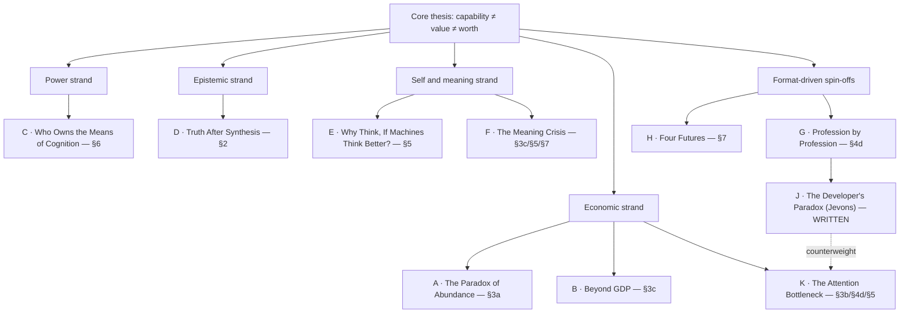
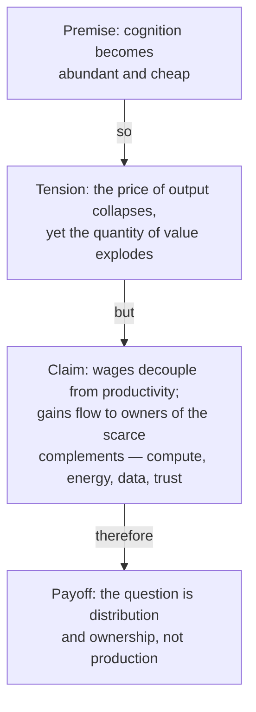
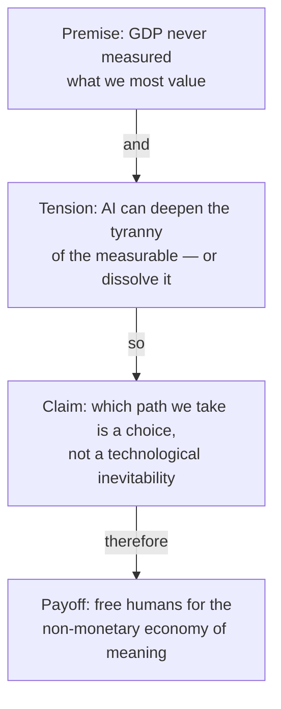
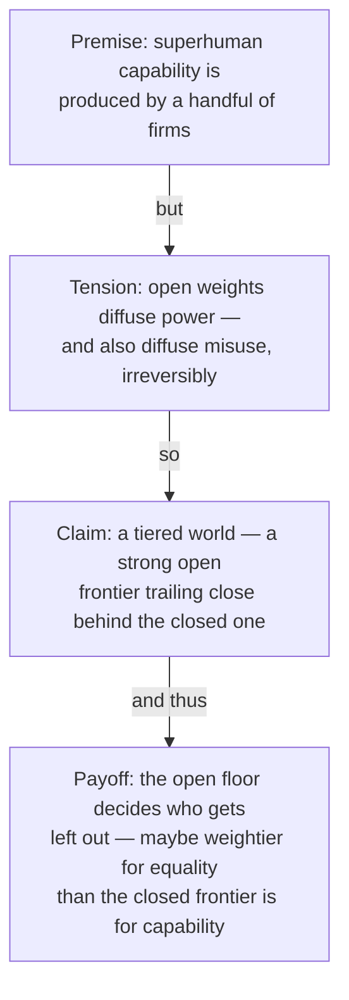
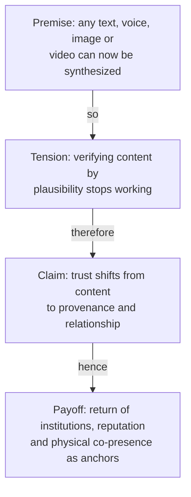
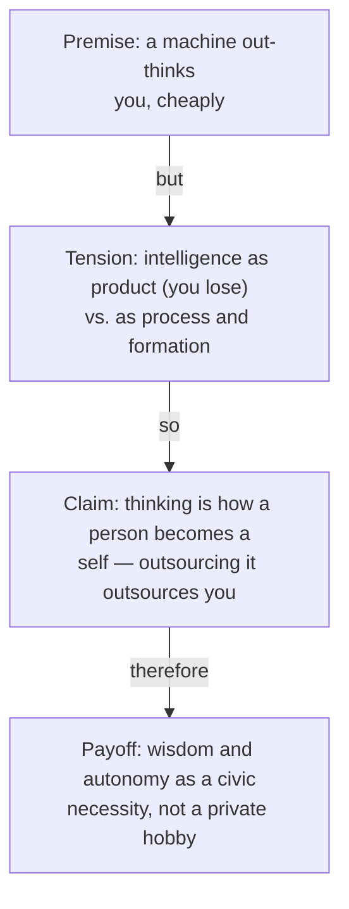
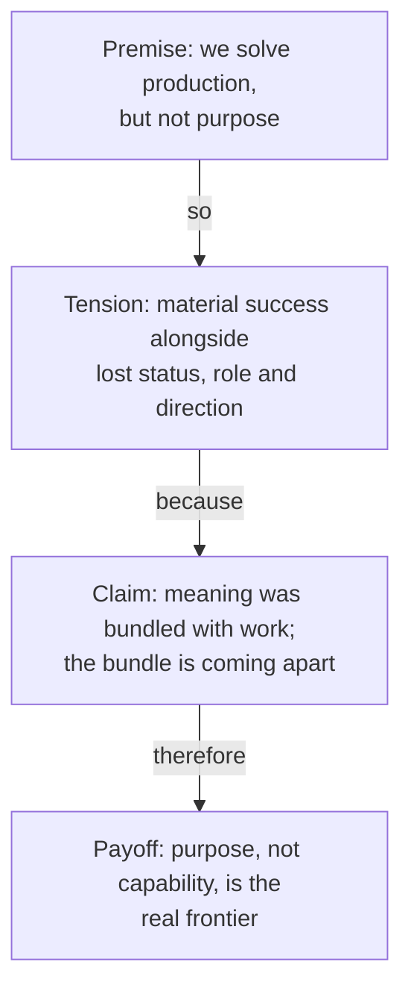
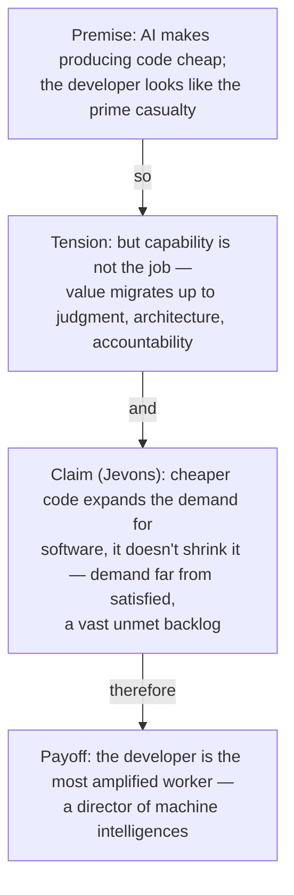
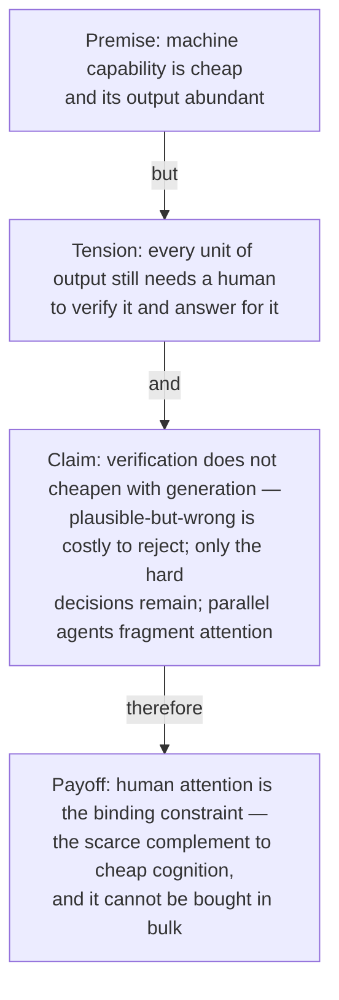

# Living With AI That Is More Intelligent Than Us

*Working scaffold for an essay — arguments, distinctions, scenarios, and structure.*

---

## 0. The framing problem (read this first)

The phrase "AI more intelligent than humans" hides three different claims that get
collapsed together. Separating them is the single most important move the essay can
make, because almost every confused public argument comes from sliding between them:

1. **Narrow superiority** — AI already beats humans at specific tasks (chess, protein
   folding, many forecasting and pattern-recognition problems, fluent text in 100
   languages). This is *uncontroversially true today* and has been creeping outward
   for decades.
2. **General superiority** — AI matches or beats the median human across most
   *economically and intellectually* relevant cognitive tasks. This is the contested,
   "happening now-ish" regime.
3. **Superintelligence** — AI exceeds the *best* humans and the *collective* of humans
   at essentially everything, including improving itself. This is the speculative tail.

> **Thesis candidate:** The interesting and urgent question is not the science-fiction
> tail (superintelligence) but the *middle regime we are already entering* — where
> machines are more capable than most humans at most cognitive work, yet are not wise,
> not accountable, and not the bearers of meaning. The task of society is to decouple
> three things we lazily bundle together: **capability, value, and worth.**

That decoupling is the spine of the whole essay. Capability (what can be done) is
migrating to machines. Value (what we economically reward) is being repriced. Worth
(what makes a human life matter) was never the same thing as either, and the AI era
forces us to finally say so out loud.

---

## 1. What kind of intelligence are we even talking about?

A core argument the reader needs early: "intelligence" is not one thing, and AI is
super-human on some axes while sub-human on others. Build a small taxonomy and use it
throughout.

| Axis | Roughly what it is | Where AI stands (2026) | Human edge? |
|---|---|---|---|
| **Crystallized / knowledge** | Recall, synthesis of known facts | Super-human breadth | No |
| **Fluid / reasoning** | Novel problem-solving in-context | Rapidly rising, uneven | Narrowing |
| **Embodied / sensorimotor** | Acting in the messy physical world | Weak, expensive | Yes, for now |
| **Social / relational** | Trust, care, reading a room, being *with* | Mimicked, not held | Yes |
| **Moral / valuational** | Deciding what *ought* to matter | Not its function | Yes (by definition) |
| **Wisdom / judgment under stakes** | Knowing what's worth doing, accepting consequences | Absent | Yes |

**Argument to develop:** Calling a system "more intelligent than humans" is a category
error if intelligence means *all of the above*. Machines are colonizing the first two
rows. The bottom three are not just "not yet solved" — some of them are arguably
*not the kind of thing a tool can have*, because they require a subject who can be
held responsible, who has something at stake, who can suffer the consequences. That is
the conceptual hinge for "what should humans focus on."

---

## 2. How the principles of living together change

Frame this as: which social institutions silently assumed that *human cognition was
scarce and valuable*, and now have to be re-founded?

- **Authority and expertise.** For centuries, status flowed from knowing things. When
  knowing is cheap and ambient, authority has to migrate to *judgment, responsibility,
  and trust* — to who decides and who is accountable, not who knows. Risk: a hollow
  "everyone is an expert now" populism, or its opposite, a priesthood of the few who
  own the models.
- **Trust and truth.** When any text, voice, image, or video can be synthesized,
  societies shift from *verifying content* to *verifying provenance and relationship*.
  Truth becomes less about "is this plausible?" and more about "whose word stands
  behind this, and what do they lose if it's false?" Expect a return of
  institutions, reputation, and physical co-presence as trust anchors.
- **Education.** If the point of education was to load knowledge into heads, it's
  obsolete. If the point was to form judgment, taste, character, and the ability to
  ask good questions, it becomes *more* important, not less. The essay can argue
  education must pivot from *answers* to *questions, discernment, and integrity*.
- **Agency and dependence.** A society that outsources cognition risks learned
  helplessness (cf. how GPS eroded navigation). Counter-argument: every tool does
  this (writing eroded memory — Plato's *Phaedrus*), and we adapted. The honest
  question is *which* capacities we must deliberately preserve in humans even when a
  machine could do them — like keeping the ability to do arithmetic, or to govern.
- **Power and concentration.** The deepest political question: superhuman capability
  is currently produced by a handful of organizations with rare compute and data.
  Living together "well" may depend less on the models' intelligence than on *who
  controls them.* (This is where open weights enters — see §6.)

---

## 3. How the economy changes — value beyond money

Your instinct that "value might not be measured by money in all cases" is strong.
Sharpen it into distinct mechanisms:

### 3a. The repricing of cognitive labor
- Classical economics: scarce, productive things command price. If general cognition
  becomes abundant and cheap, the *price* of cognitive output collapses toward the cost
  of compute — even as the *quantity* of valuable output explodes (the "paradox of
  abundance": more value created, less of it captured as wage income).
- Wages historically tracked productivity *because labor was the bottleneck.* Remove
  the bottleneck and that link can break. The gains accrue to whoever owns the scarce
  complements: compute, energy, data, distribution, trust, and physical capacity.
- **Therefore the policy fault line:** ownership and distribution, not production.
  Candidates to discuss — UBI, universal *capital* / sovereign-wealth-style dividends
  on AI productivity, data dividends, shorter work, public compute. Each has a failure
  mode; present them as trade-offs, not solutions.

### 3b. What stays scarce (and thus valuable) when intelligence is cheap
A useful list to build the argument around — value migrates here:
- **The authentically human** — things valued *because* a human did them (live
  performance, craft, the handmade, "I wanted a person to do this for me").
- **Trust and accountability** — someone who can be blamed, sued, fired, thanked.
- **Physical presence and care** — bodies in rooms: nursing, trades, hospitality,
  parenting, repair.
- **Attention, taste, and curation** — when content is infinite, the scarce good is
  *selection* and *the trusted filter.*
- **Supervisory bandwidth** — distinct from curation above: not choosing among finished
  things, but holding several machine-driven work streams in mind, verifying each, and
  answering for the result. When machines produce more work than anyone can check, the
  binding constraint on output is the attention of whoever must vouch for it — and unlike
  compute, it cannot be bought in bulk. (Developed as spin-off K below.)
- **Energy, materials, land, compute** — the unglamorous physical substrate.
- **Legitimacy** — the right to decide, which we may *refuse* to delegate to machines
  even when they'd decide "better."

### 3c. Value that was never money in the first place
Push the essay's most original section here: GDP was always a poor proxy for what we
care about (care work, friendship, meaning, ecological health were invisible to it).
An AI economy could either (a) deepen the tyranny of the measurable, or (b) finally
free humans to invest in the *non-monetary economy of meaning* — relationships,
community, art, stewardship — because the monetary one needs less of us. Which path we
get is a *choice*, not a technological inevitability. This is the essay's hopeful hinge.

**External anchor — the UN Beyond GDP report (2026).** The claim that GDP mismeasures what matters
is no longer heterodox; it is now an official UN proposal, which is what lets §3c stand as
corroborated argument rather than the essayist's intuition. *Counting What Counts: A Compass of
Progress for People and Planet* is the final report of the Secretary-General's Independent
High-Level Expert Group on Beyond GDP (co-chaired by Kaushik Basu and Nora Lustig; members include
Joseph Stiglitz). The SG appointed the Group in May 2025 at Member States' request in the Pact for
the Future — the first time the UN has built a proposal of this kind in response to such a request.

Its organizing idea: *progress means equitable, inclusive, and sustainable well-being.* It proposes
a **dashboard of 31 indicators** in four components — (1) foundational principles (peace, human
rights, respect for the planet); (2) current well-being (material conditions and work, health,
education, security, subjective well-being, social cohesion, quality of institutions, environmental
quality); (3) equity and inclusion; (4) sustainability and resilience (produced, human, social,
institutional and natural capital) — plus a recommended headline aggregate under the rubric
*"Well-being Beyond GDP"* and an annual *Beyond GDP global progress report*.

Quotes that arm §3c directly:
- *"We have come to expect answers from it that it was never designed to give."*
- *"What we measure shapes what we value."* … *"This report does not ask the world to abandon GDP.
  It asks something more ambitious: to look at the full picture, and to act accordingly."*
- *"GDP growth and public sentiment have come apart"* — the report's own near-echo of the essay's
  "value and money come apart."
- Kuznets (1934): *"The welfare of a nation can scarcely be inferred from a measurement of national
  income"*; Stiglitz–Sen–Fitoussi (2009): shift *"from measuring economic production to measuring
  people's well-being."*

Bonus for the essay's AI thesis — the report itself makes our move: it singles out AI as possibly
*"writing the next chapter"* of the Industrial-Revolution story, warns that to *"judge the merit of
artificial intelligence to society by its contribution to GDP alone would be myopic,"* notes value
migrating to intangibles and *"zero-price digital services"* that market measures miss, and even
sketches a headline index in which income is *"penalized"* when non-monetary well-being is weak.
- Final report (PDF): https://www.un.org/sites/un2.un.org/files/high-level_expert_group_on_beyond_gdp_final_report.pdf
- Programme hub: https://www.un.org/en/beyondGDP

---

## 4. What should humans focus on? Which jobs?

Reframe the question from "what can humans still do that AI can't" (a losing,
ever-shrinking race) to **"what do we *want* to remain human, and what is robustly
valuable?"** Two different lists:

**Robustly demanded (economic logic):**
- Work fused with the physical world and the unstructured environment (skilled trades,
  care, logistics-of-atoms) — slowest to automate, hard to offshore.
- Work where a human *must* be accountable (medicine, law, governance, safety) — the
  human as the "responsible party," even if AI does the cognition.
- Work that is the interface *between* AI and reality: translating goals into systems,
  judging AI output, integrating, deciding. ("Manager of intelligences.")
- Work valued for its human origin (see §3b).

**Worth choosing (human logic):**
- Caring for others, raising children, sustaining community.
- Making and stewarding — art, science as exploration, repair of the natural world.
- Governing ourselves — citizenship is not automatable without ceasing to be self-rule.

**Honest counter-argument to include:** "focus on the human stuff" is cold comfort to
someone whose income depended on the cognitive work now automated, and these
transitions have historically been brutal and unevenly distributed *even when the
long-run aggregate improved.* The essay loses credibility if it skips the pain of
transition. Name it; treat distribution and timing as the real problem.

### 4d. A worked example: the software engineer
*(Expanded into its own case-study section in the essay — §IX. Use it as the concrete
instance that makes the abstract argument legible, and because the engineer is reflexive:
she builds the very systems automating her.)*

- **Why this case is special:** (1) coding is among the *fastest*-automating cognitive
  tasks, so engineers already live in the forecast world; (2) engineers are reflexive —
  they build the tools remaking them, so they can *steer* the outcome, not just suffer it.
- **The displacement (be honest):** producing code *as code* is crystallized+fluid work
  the machine does cheaply; its wage-value drifts toward the cost of compute. The junior
  rung (boilerplate, well-specified functions, ticket→patch) automates first → the
  **ladder problem**: if the bottom rungs vanish, how does anyone climb to the judgment the
  top still rewards? The two-years-in engineer lives the §6/transition pain *first*.
- **What survives (= where to turn) — each maps to an earlier section:**
  - Deciding *what* to build — taste, product sense, problem definition (the §2/§4
    "interface between AI and reality").
  - *Judging* machine output — sceptical review, telling subtly-wrong from right (the
    §5 meta-cognitive skill of auditing an intelligence faster than your own). Moves from
    periphery to centre of the job.
  - *Accountability* — owning correctness, security, consequences; on-call at 3 a.m.; the
    name on the failing design. A model cannot be the responsible party.
  - *Architecture* — holding the whole, deciding trade-offs, integrating machine-written
    parts into something coherent and safe.
- **How to be successful (the prescription):**
  - Migrate *up the abstraction stack*: from producing the artifact to specifying,
    judging, integrating, owning. Become a *director of machine intelligences* —
    orchestrate fleets of agents; supply the judgment.
  - Two good roads up: **depth** (security, performance, distributed systems, the novel,
    hardware/physical-world — where machines are weak and mistakes are costly) or
    **breadth with ownership** (the accountable builder who now ships what took a team).
    The withering middle = commodity code the machine makes for free.
  - **Engage open models** (ties to §6): run/inspect/adapt open systems vs. renting closed
    ones; sovereignty over tools. The most-exposed workers are also those whose collective
    choices decide diffusion vs. concentration — engineers are *drivers*, not passengers.
  - **Keep your own judgment sharp** (ties to §5's civic/autonomy warning, personalized):
    value is migrating from what you produce to what you judge; judgment atrophies if you
    let the tool think. Use the machine relentlessly; never let it replace the
    understanding that knows whether the output is right.
  - **And survive exercising it** — the opposite failure mode, and the more common one
    among heavy users. What is left after the machine takes the routine is *all* judgment:
    only hard decisions reach you, the pace is set by something that does not tire,
    verifying fluent-but-sometimes-wrong output never stops, and running several agents at
    once fragments attention across unfinished problems. The low-load work that used to
    pace a day is the first thing automated away. Bainbridge's *ironies of automation*
    (1983): automation leaves the human the hard residue and demands indefinite vigilance
    for it. So the prescription is two-sided — don't let judgment wither, *and* arrange the
    work so that judging all day stays sustainable. (Full line of argument: spin-off K.)

---

## 5. Is intelligence still worth striving for?

A genuinely interesting philosophical question — don't resolve it too fast. Stage it as
a tension:

- **The deflationary view:** If a machine out-thinks you cheaply, cultivating your own
  intellect is like training to out-run a car. Sentimental, not useful.
- **The reply (and the essay's likely position):** This conflates intelligence as
  *product* with intelligence as *process and formation.* We don't lift weights because
  the world lacks forklifts; we lift because of what it does to the lifter. Thinking is
  partly *how a person becomes a self* — it builds judgment, autonomy, the capacity to
  not be manipulated, the inner life. Outsourcing all of it is outsourcing *yourself.*
- **The crucial distinction — which intelligence to strive for:** shift the human goal
  from *raw capability* (where we lose) to **wisdom**: knowing what is worth wanting,
  judgment under uncertainty and stakes, the integration of knowledge with values and
  consequences. Also: **meta-cognitive and collaborative** intelligence — the skill of
  *directing, questioning, and auditing* intelligences greater than yourself without
  being captured by them. And the most human: the intelligence of *meaning* — knowing
  why anything matters at all, which is not a computation.
- **A warning to voice:** a population that stops striving to think becomes trivially
  manipulable by whoever runs the machines. So intelligence-as-autonomy may be a
  *civic necessity*, not a personal hobby — the cognitive equivalent of an armed
  citizenry or a free press.

---

## 6. Open-weights models: why they matter to all of the above

This deserves its own section because it changes *who holds the power*, which is the
hidden variable under §2, §3, and §7.

- **What they are / the stakes:** models whose weights are openly released can be run,
  inspected, and adapted by anyone with hardware — versus closed APIs controlled by a
  few firms. The fault line is **concentration vs. diffusion of superhuman capability.**
- **The case *for* (and why it intersects your themes):**
  - *Power distribution.* Open weights are the main counterweight to a world where 3–5
    companies (and their host states) own the means of cognition. They make the
    economic gains of §3 contestable rather than monopolized.
  - *Sovereignty & resilience.* Nations, communities, and individuals can run capability
    locally — no kill-switch, no rent, no surveillance-by-default, survives a company's
    bankruptcy or change of heart.
  - *Trust through transparency.* Inspectable systems can be audited; closed ones must
    be taken on faith.
  - *A commons.* They make advanced AI a public good rather than a metered utility —
    directly relevant to the "value beyond money" theme: a shared capability nobody
    has to buy.
- **The case *against* / the hard tension:**
  - Diffusion is irreversible. Open weights also diffuse *misuse* capability (bio, cyber,
    disinfo) with no recall. You cannot un-release.
  - The safety/openness dilemma is *genuinely unresolved* — present it as a real
    trade-off, not a solved debate. More openness = more freedom and resilience *and*
    more uncontrollable risk.
- **The likely synthesis (a defensible position):** a *tiered* world — frontier
  capability stays semi-closed and governed for a window, while a powerful open ecosystem
  trails close behind and guarantees that capability never becomes a pure monopoly. The
  interesting claim: **the open-weights frontier sets the floor of who-gets-left-out**,
  so it may matter more for *equality and freedom* than the closed frontier matters for
  *raw capability.* This connects open weights directly to your "how do we live together
  justly" question.

---

## 7. Scenario framework — paths into the future

Rather than listing random scenarios, generate them from **two axes** that you can
defend as the decisive variables:

- **Axis A — Capability trajectory:** plateau / steady climb / sharp takeoff.
- **Axis B — Distribution of control:** concentrated (few firms/states) ↔ diffused
  (open, broadly held).

(A third axis worth a paragraph: **alignment/controllability** — do the systems
reliably do what we intend? You can hold it fixed as "mostly yes" for the social-essay
and flag the tail risk separately.)

Four illustrative quadrants:

1. **Concentrated + steady climb — "Feudal abundance / Cloud lords."** Capability is
   immense but rented from a few owners. Material abundance possible, but power and
   wealth concentrate; most humans are dependents/consumers. The central fight is
   distribution and political voice. *Most likely default path.*
2. **Diffused + steady climb — "Pluralist tools / Renaissance."** Open weights + good
   institutions spread capability. Looks like past general-purpose technologies
   (electricity, internet): disruptive, broadly empowering, messy but net-leveling.
   The optimistic-but-plausible target.
3. **Concentrated + sharp takeoff — "Singleton / lock-in."** Whoever leads gains
   decisive, possibly permanent advantage. Highest-stakes, includes both
   "benevolent stable order" and "irreversible tyranny." Governance is everything.
4. **Diffused + sharp takeoff — "Wildfire."** Maximum capability in maximum hands.
   Maximal freedom and maximal catastrophe-by-anyone risk. The safety/openness dilemma
   at its sharpest.

Plus two cross-cutting scenarios worth naming:
- **"Mundane transformation"** (a plateau world): AI is a powerful-but-bounded tool,
  like the PC or internet — it reshapes work and life profoundly but humans stay firmly
  in the loop. Underrated as a *base case*; saves the essay from sci-fi tunnel vision.
- **"Meaning crisis"** (orthogonal to all four): even in material success, a society
  that solved production but not *purpose* faces widespread loss of meaning, status, and
  direction. This is arguably the scenario the essay is *really* about, and where its
  prescriptions (§3c, §4, §5) pay off.

**Use the framework to make a point:** the technology under-determines the outcome. The
variable we actually control is **distribution of power and the choice of what to value**
— which is exactly why §3c, §5, and §6 are the load-bearing arguments, not the
capability forecasts.

---

## 8. Possible essay structures

Pick one spine; the sections above slot into any of them.

- **A. Problem → Reframe → Paths → Prescription** (recommended)
  1) The collapse we fear (cognition automated) →
  2) the three-way decoupling of capability/value/worth (§0–1) →
  3) what changes: society (§2), economy (§3), work (§4), self (§5) →
  4) who holds the power: open weights (§6) →
  5) scenarios (§7) →
  6) the choice: what to value, how to distribute. End on agency, not prophecy.

- **B. Question-driven.** Take your original questions one per section. More personal,
  essayistic; risk of feeling like a list. Mitigate with a strong recurring thesis.

- **C. Scenario-driven.** Open with the four futures (§7), then derive the human
  questions from them. Vivid and concrete; risk of feeling speculative. Good if you
  want narrative pull.

---

## 9. Recurring threads to keep the essay coherent

Weave these so the piece feels like one argument, not eight:
1. **Capability ≠ value ≠ worth** (the spine).
2. **The decisive variable is distribution of power, not raw capability** (so politics
   and open weights matter more than IQ-of-the-machine).
3. **Technology under-determines outcomes; what we choose to value is the free variable**
   (anti-determinism — preserves human agency and gives the reader something to *do*).
4. **Wisdom over capability** as the human north star.

---

## 10. Things to get right (credibility checklist)

- Distinguish the three regimes (§0) — don't equivocate between "AI beats us at X" and
  "AI is a superior being."
- Don't skip the *pain and injustice of transition* (§4) — it's the easiest way to lose
  a thoughtful reader.
- Present open weights and the safety/openness dilemma as a *genuine trade-off* (§6),
  not a solved question.
- Avoid both techno-utopianism and doom; the honest position is *contingency* — it
  depends on choices.
- Define "intelligence" before claiming AI has more of it (§1).
- Separate *forecast* (what will happen) from *prescription* (what we should do). Keep
  them in different sections so the reader can disagree with one and accept the other.

---

## 11. Potential follow-up articles — distinct lines of argument

Several sections above are dense enough to grow into standalone pieces. The map below
shows the candidates, grouped by the strand of the core thesis they extend; the small
flowcharts under it trace each candidate's *line of argument* — premise → the tension it
turns on → central claim → payoff — so you can see at a glance whether two ideas are
genuinely different articles or the same argument twice.

*(All diagrams are Mermaid; GitHub renders them inline in both the web and the mobile app.)*

### The map of spin-offs

### A · The Paradox of Abundance *(from §3a)*
The economics of cheap cognition: more value created, less of it captured as wage income.

### B · Beyond GDP *(from §3c)*
What we measure versus what we value — the essay's most original, most hopeful strand.
*Real-world hook:* peg the piece to the UN's 2026 *Counting What Counts* (Beyond GDP) report and
its 31-indicator wellbeing / planet / equity dashboard — which itself flags AI as "writing the next
chapter" and floats an income measure "penalized" for weak non-monetary well-being. A concrete,
newsworthy anchor for an otherwise philosophical argument (full citation under §3c).

### C · Who Owns the Means of Cognition *(from §6)*
The political piece: concentration versus diffusion of superhuman capability.

### D · Truth After Synthesis *(from §2)*
The epistemic piece: trust when any artifact can be fabricated.

### E · Why Think, If Machines Think Better? *(from §5)*
The philosophical piece: intelligence as product versus as formation of a self.

### F · The Meaning Crisis *(from §3c / §5 / §7)*
The existential piece — arguably the scenario the whole essay is really about.

### Format-driven spin-offs (same arguments, new container)
Two further articles are worth flagging, but they extend the essay's *form*, not its
argument — they reuse the lines above rather than open new ones, which is why they get no
separate spine here:

- **G · Profession by Profession (§4d).** Take the engineer case-study template —
  displacement → what survives (accountability, judgment, presence) → how to move up the
  abstraction stack — and run it for the doctor, the lawyer, the teacher, the accountant,
  the designer. One recurring spine, a new worked instance each time; ideal as a series.
- **H · Four Futures (§7).** Dramatize the two-axis scenario grid as narrative foresight —
  four vivid short futures plus the two cross-cutting ones. Its value is concreteness and
  narrative pull; the analytical argument is inherited wholesale from §7.

### J · The Developer's Paradox *(written — `software-developers.md` / `.de.md`)*
The optimistic companion to §IX / §4d: the same capability→value migration, but turned hopeful by
*Jevons's paradox* — cheaper code expands the demand for software rather than shrinking it, so the
developer ends up amplified, not displaced. Worked through four historical cases (compilers and
high-level languages, the spreadsheet and the accountant, ATMs and bank tellers, cloud and
infrastructure-as-code) plus the original coal example. This is the one genuinely new argument-line
beyond §11's original list, which is why it earns its own spine:

### K · The Attention Bottleneck *(from §3b / §4d / §5)*
The counterweight to J, and the honest sequel to it. J establishes that cheap code expands the
work rather than shrinking it; K asks who is going to have the attention to supervise all of it.
The premise is that capability is now cheap and its output abundant — but every unit of machine
output still needs a human who verifies it and answers for it, and verification does *not* cheapen
at the rate generation does. Arguably it gets dearer: plausible-but-wrong output is harder to reject
than obviously-wrong output, because there is no cheap rejection signal, so the reviewer must
reconstruct the reasoning to know whether to trust it. Add three compounding effects — only the hard
decisions now reach the human, the pace is set by machines that do not tire, and running several
agents at once fragments attention across unfinished problems — and the conclusion is that human
attention, not compute and not model capability, becomes the binding constraint on AI-augmented
output.

Two things make this line worth writing separately rather than folding into J. First, it inverts the
usual worry: the standard fear is that AI makes people mentally lazy (§5's atrophy argument), while
the reported experience of people using it hardest is the opposite — a *heavier*, denser day, because
what was automated away first is the low-load work that used to pace it. Both are true, of different
people, and the essay should say so. Second, it has harder empirical support than any other spin-off
here: DORA's "verification tax" (time saved writing is re-spent auditing, alongside AI-correlated
gains in throughput *and* in instability), Stack Overflow's finding that "almost right, but not
quite" output is developers' single largest frustration with debugging AI-generated code second, and
METR's randomized trial in which experienced developers were measurably slower with AI while
believing themselves substantially faster. The perception gap is itself part of the argument.

The intellectual lineage is older than the tools and should be used: Bainbridge's *Ironies of
Automation* (1983) — automation takes the easy parts of a task and leaves the human the hard
residue, then demands indefinite vigilance for it — plus the literature on automation complacency,
out-of-the-loop performance, and attention residue in task-switching. That framing keeps the piece
from reading as complaint; it is a well-documented structural pattern arriving in a new domain.

Payoff and stakes: if human attention is the true bottleneck, then a great deal of AI strategy is
mis-aimed. Buying more capability past the point where anyone can supervise it does not produce more
usable output; it produces more unverified output, which is a liability rather than an asset. This
ties back to §3b (attention as the scarce complement to cheap cognition), to §5 (judgment as the
faculty being taxed rather than the one being lost), and to §IX/§4d (the engineer as the first worker
to live inside the constraint).

---

## Open questions for you (shape the next draft)
- **Audience & register:** general-public op-ed, a more philosophical long essay, or
  policy-flavored? This changes how much §3a/§6 detail to keep.
- **Your own stance:** are you closer to cautious-optimist, worried, or deliberately
  neutral? The essay is stronger with a thesis it's willing to defend.
- **Length target?** (Op-ed ~1,200 words forces ruthless cuts; a 4,000–6,000 word essay
  can carry most of the above.)
- **Want me to draft a full section next** (e.g., the economic one, or the open-weights
  one) so you can react to real prose rather than an outline?
